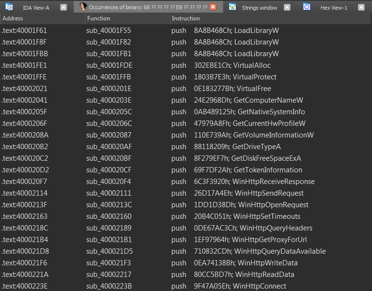

# Uchihash

Uchihash is a small utility that can save malware analysts the time of dealing with embedded hash values used for various things such as:

- Dynamically importing APIs (especially in shellcode)
- Checking running process used by analysts (Anti-Analysis)
- Checking VM or Antivirus artifacts (Anti-Analysis)

Uchihash can generate hashes with your own custom hashing algorithm, search for a list of hashes in an already generated hashmap and also it can generate an IDAPython script to annotate the hashes with their corresponding values for easier analysis.

# Installation

```
$ git clone https://github.com/N1ght-W0lf/Uchihash.git
$ pip install -r requirements.txt
```

# Usage

```
usage: uchihash.py [-h] [--algo ALGO] [--apis] [--keywords] [--list LIST] [--script SCRIPT] [--search SEARCH] [--hashes HASHES] [--ida]

optional arguments:
  -h, --help       show this help message and exit
  --algo ALGO      Hashing algorithm
  --apis           Calculate hashes of APIs
  --keywords       Calculate hashes of keywords
  --list LIST      Calculate hashes of your own word list
  --script SCRIPT  Script file containing your custom hashing algorithm
  --search SEARCH  Search a JSON File containing hashes mapped to words
  --hashes HASHES  File containing list of hashes to search for
  --ida            Generate an IDAPython script to annotate hash values

Examples:
    * python uchihash.py --algo crc32 --apis
    * python uchihash.py --algo murmur3 --list mywords.txt
    * python uchihash.py --search hashmap.txt --hashes myhashes.txt
```

# Notes

- **`--algo`**: One of the available hashing algorithms

- **`--apis`**: Hashes a huge list of windows APIs (see [data/apis_list.txt](https://github.com/N1ght-W0lf/Uchihash/blob/main/data/apis_list.txt))
- **`--keywords`**: Hashes a list of common keywords used by malware families such as Analysis tools and VM/Antivirus/EDR artifacts (see [data/keywords_list.txt](https://github.com/N1ght-W0lf/Uchihash/blob/main/data/keywords_list.txt))
- **`--list`** :  Words are separated by a newline (see [examples/mywords.txt](https://github.com/N1ght-W0lf/Uchihash/blob/main/examples/mywords.txt))
- **`--script`**: Hashing function must be called `hashme()` and the return value must be in hex format `0xDEADBEEF` (see [examples/custom_algo.txt](https://github.com/N1ght-W0lf/Uchihash/blob/main/examples/custom_algo.py))
- **`--search`**: File to search must be in JSON format (see [examples/searchme.txt](https://github.com/N1ght-W0lf/Uchihash/blob/main/examples/searchme.txt))
- **`--hashes`**: Hash values are separated by a newline and they must be in hex format (see [examples/myhashes.txt](https://github.com/N1ght-W0lf/Uchihash/blob/main/examples/myhashes.txt))

see examples folder for more clarification

# Available Hashing Algorithms

- md4
- md5
- sha1
- sha224
- sha256
- sha384
- sha512
- ripemd160
- whirlpool
- crc8
- crc16
- crc32
- crc64
- djb2
- sdbm
- loselose
- fnv1_32
- fnv1a_32
- fnv1_64
- fnv1a_64
- murmur3

# Example

Let's take an examples with a real malware family, in this case we have **`BuerLoader`** which is using hash values to dynamically import APIs and it's using a custom hashing algorithm.

First we need to implement the hashing algorithm in python:

```python
def ROR4(val, bits, bit_size=32):
    return ((val & (2 ** bit_size - 1)) >> bits % bit_size) | \
           (val << (bit_size - (bits % bit_size)) & (2 ** bit_size - 1))
    
def hashme(s):
    res = 0
    for c in s:
        v3 = ROR4(res, 13)
        v4 = c - 32
        if c < 97:
            v4 = c
        res = v4 + v3
    return hex(res)
```

Then we calculate the hashes of all APIs:

```
$ python uchihash.py --script custom_algo.py --apis
```

Finally we search for the hash values that BuerLoader is using in the generated hashmap, we can also generate an IDAPython script to annotate those hash values with their corresponding API names:

```
$ python uchihash.py --search output/hashmap.txt --hashes buer_hashes.txt --ida
```

We should get 2 output files, one is **`"output/search_hashmap.txt"`** which maps BuerLoader's hash values to API names:

```
{
  "0x8a8b468c": "LoadLibraryW",
  "0x302ebe1c": "VirtualAlloc",
  "0x1803b7e3": "VirtualProtect",
  "0xe183277b": "VirtualFree",
  "0x24e2968d": "GetComputerNameW",
  "0xab489125": "GetNativeSystemInfo",
  .......
}
```

The other file is **`"output/ida_script.py"`** which will add the comments to your idb:


